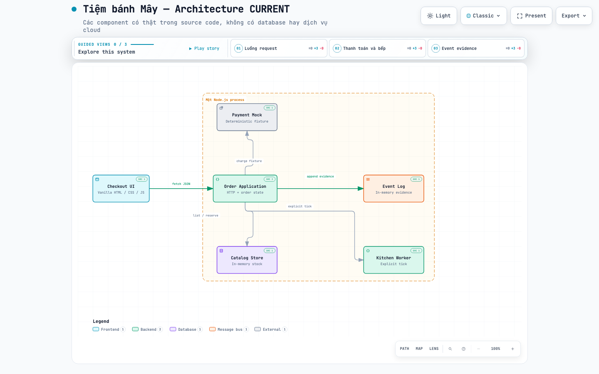

# Archify End-to-End Tutorial — Tiệm bánh Mây

Repository này là một ứng dụng web chạy thật kèm tutorial dùng AI Agent và
[Archify](https://github.com/tt-a1i/archify) để tạo diagram từ source code.

Đây không phải bộ ảnh mẫu rời rạc. Bạn có thể chạy app, tạo một order, xem state
thay đổi, chạy test, đọc prompt đã dùng, rồi đối chiếu từng node và edge trong
diagram với evidence.

## Trả lời ngắn hai câu hỏi phổ biến

**Archify có đọc source rồi vẽ flow không?** AI Agent đọc source, test và log;
Archify cung cấp schema, validator, renderer và viewer. Nếu prompt chỉ mô tả một
ý tưởng, agent cũng có thể vẽ thiết kế `PROPOSED`, nhưng sơ đồ đó không chứng
minh app chạy được.

**Gắn Archify vào AI thế nào?** Cài thư mục skill vào nơi AI Agent tìm skill,
khởi động lại phiên agent, rồi gọi rõ tên `Archify` trong prompt. Xem command và
cách tự kiểm tra tại [Hướng dẫn cài skill](docs/ai-agent-setup.md).

## Chạy app trong 3 phút

Yêu cầu: Git và Node.js 20 trở lên. App không có runtime dependency bên ngoài.

```bash
git clone https://github.com/thieung/archify-tiem-banh-may-tutorial.git
cd archify-tiem-banh-may-tutorial
npm run check
npm start
```

Mở `http://localhost:3000`, chọn bánh, nhập tên và dùng token `tok_success`.
Sau khi thanh toán, bấm hai lần `Chạy kitchen tick`, rồi `Hoàn tất đơn`.
Kết quả mong đợi: order đi đến `COMPLETED`.

## Xem diagram đã render

| Câu hỏi | Prompt | JSON kiểm tra được | HTML tương tác | Receipt |
|---|---|---|---|---|
| Hệ thống gồm gì? | [Architecture](prompts/01-architecture-current.md) | [JSON](diagrams/current/architecture-current.json) | [HTML](diagrams/current/architecture-current.html) | [Receipt](evidence/archify-architecture-receipt.md) |
| Order chạy qua bước nào? | [Workflow](prompts/02-workflow-current.md) | [JSON](diagrams/current/workflow-current.json) | [HTML](diagrams/current/workflow-current.html) | [Receipt](evidence/archify-workflow-receipt.md) |
| Các thành phần gọi nhau theo thứ tự nào? | [Sequence](prompts/03-sequence-current.md) | [JSON](diagrams/current/sequence-current.json) | [HTML](diagrams/current/sequence-current.html) | [Receipt](evidence/archify-sequence-receipt.md) |
| Dữ liệu đi đâu? | [Data Flow](prompts/04-dataflow-current.md) | [JSON](diagrams/current/dataflow-current.json) | [HTML](diagrams/current/dataflow-current.html) | [Receipt](evidence/archify-dataflow-receipt.md) |
| Order đổi state thế nào? | [Lifecycle](prompts/05-lifecycle-current.md) | [JSON](diagrams/current/lifecycle-current.json) | [HTML](diagrams/current/lifecycle-current.html) | [Receipt](evidence/archify-lifecycle-receipt.md) |

GitHub hiển thị source HTML thay vì chạy file. Hãy tải repository và mở file
HTML bằng browser để dùng theme, guided views, trace motion và export.



## Học theo lộ trình

1. Đọc [lộ trình học](docs/learning-path.md).
2. Làm theo [guide end-to-end](docs/end-to-end-guide.md).
3. Dùng [hướng dẫn cài skill](docs/ai-agent-setup.md) nếu agent chưa nhận Archify.
4. Checkout từng [branch/tag học tập](docs/git-learning-history.md) để xem app lớn dần.
5. Dùng [source map](evidence/source-map.md) để bắt lỗi AI suy diễn.

## Verification nhanh

```bash
npm run check
ARCHIFY_SKILL_ROOT=/đường/dẫn/tới/archify npm run diagrams:check
```

`npm run check` chạy 20 test tuần tự và tái tạo
`evidence/happy-path-order.json`. `diagrams:check` chạy showcase validation cho
cả năm JSON và chỉ pass khi mỗi diagram đạt 9/9, 0 error, 0 warning.

## Phạm vi trung thực

App dùng memory của một process và payment fixture deterministic. Nó không có
database, queue, authentication, cloud infrastructure hay cổng thanh toán thật.
Những thành phần đó không xuất hiện trong diagram `CURRENT`.

Repository artifact cũ được giữ riêng tại
[archify-tiem-banh-may-demo](https://github.com/thieung/archify-tiem-banh-may-demo).

## License

MIT
